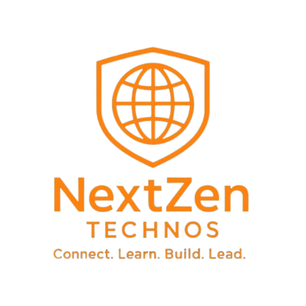

# NextZen Technos — Official Community Platform

<p align="center">
  
</p>

<p align="center">
  <strong>Gateway to a Growing Tech Community for Learners, Developers & Innovators.</strong>
</p>

<p align="center">
  <a href="https://nextzentechnoswebsite.vercel.app"></a>
  <a href="https://chat.whatsapp.com/Cykv2WSysF09uCM1V5VenN"></a>
</p>

---

## 🌟 Overview

**NextZen Technos** is a modern, interactive web application built to empower students, self-taught developers, and tech enthusiasts. The platform provides access to industry-oriented courses, daily hiring updates, hackathon notifications, real-time doubt support, and interactive developer tools.

Designed with **Glassmorphism**, **3D GPU Perspective tilt**, **Dynamic Specular Light Glare**, and **SPA smooth routing**, NextZen delivers an aesthetic user experience across both desktop and mobile devices.

---

## ✨ Features & Architecture

### 🚀 Core Platform Highlights
- **Dynamic Hero & Constellation Background**: Interactive canvas node network (`ParticleCanvas.jsx`) with dynamic typewriter terminal tabs (`community.json`, `placement.sh`, `metrics.py`).
- **Interactive Zen Lounge (`ZenLounge.jsx`)**: 
  - ⌨️ **Code Speed & Accuracy Test**: Real-time WPM calculation, accuracy tracking, auto-timer, and visual syntax highlight cursor.
  - 🧠 **Tech Trivia Quiz**: Interactive multiple-choice coding quiz with instant visual feedback and score summaries.
  - 🎵 **Solfeggio 174Hz Focus Audio**: Built-in Web Audio API frequency generator for concentration during coding sessions.
- **Skill-Boosting Course Catalog (`Courses.jsx`)**: Searchable and filterable catalog with live categories (Programming, Web Dev, Data & AI).
- **Upcoming Events & Cohorts (`Events.jsx`)**: Live countdown timer ticker for upcoming internship cohorts and workshops.
- **Mobile First Navigation (`Navbar.jsx`)**: iOS-inspired glass bottom tab navigation for mobile devices and top glass header restorer.

### 🎨 Visual & Aesthetic Design
- **Glassmorphism UI**: High-density backdrop blur (`24px`), custom gradients, and ambient backdrop glow meshes (`GlowBlobs.jsx`).
- **GPU 3D Depth Perspective (`use3DTilt.js`)**: Real-time cursor tracking 3D tilt perspective with dynamic lighting glare reflections and depth drop-shadows.

---

## 🛠️ Technology Stack

| Category | Technology |
| :--- | :--- |
| **Frontend Core** | React 19, JavaScript (ES6+), HTML5 |
| **Build Tooling** | Vite 8, Oxlint |
| **Routing** | React Router DOM v7 |
| **Styling** | Vanilla CSS3 (Custom Design System, Glassmorphism, 3D CSS Transforms) |
| **Audio** | Web Audio API |
| **Deployment** | Vercel |

---

## 📁 Project Directory Structure

```text
nextzen/
├── public/
│   ├── Logo.png               # Brand Logo Asset
│   └── bg.jpg                 # Background Texture
├── src/
│   ├── components/
│   │   ├── Collab.jsx         # Industry Collaboration Section
│   │   ├── Courses.jsx        # Skill-Boosting Courses Catalog
│   │   ├── Events.jsx         # Live Countdown & Event Cards
│   │   ├── Footer.jsx         # Platform Footer
│   │   ├── Founder.jsx        # Leadership & Founder Section
│   │   ├── GlowBlobs.jsx      # Ambient Animated Glow Meshes
│   │   ├── Hero.jsx           # Interactive Hero Banner
│   │   ├── Join.jsx           # Call-To-Action Community Join Box
│   │   ├── Navbar.jsx         # Desktop Glass Header & Mobile iOS Bottom Bar
│   │   ├── ParticleCanvas.jsx # Constellation Node Network Background
│   │   ├── RouteProgressBar.jsx # SPA Navigation Loading Bar
│   │   ├── Services.jsx       # Offerings & Value Proposition
│   │   ├── WhatsAppWidget.jsx # Floating Community Callbox
│   │   └── ZenLounge.jsx      # Developer Refreshment & Code Speed Test
│   ├── hooks/
│   │   └── use3DTilt.js       # Custom 3D GPU Tilt & Lighting Hook
│   ├── pages/
│   │   ├── AboutPage.jsx      # Dedicated About Us Page
│   │   ├── ContactPage.jsx    # Dedicated Contact & Inquiry Form
│   │   └── EventsPage.jsx     # Dedicated Events Overview Page
│   ├── App.jsx                # Main Application Layout & SPA Routing
│   ├── main.jsx               # React DOM Entry Point
│   └── index.css              # Global Design System & Variables
├── package.json               # Dependencies & Scripts
├── vercel.json                # Vercel Deployment Configuration
└── vite.config.js             # Vite Configuration
```

---

## 💻 Getting Started Locally

### Prerequisites
Make sure you have [Node.js](https://nodejs.org/) (v18 or higher) installed on your machine.

### Installation

1. **Clone the Repository**:
   ```bash
   git clone https://github.com/nextzentechnos-lang/nextzentechnoswebsite.git
   cd nextzen
   ```

2. **Install Dependencies**:
   ```bash
   npm install
   ```

3. **Launch Local Development Server**:
   ```bash
   npm run dev
   ```
   Open your browser and navigate to `http://localhost:5173`.

4. **Build for Production**:
   ```bash
   npm run build
   ```

---

## 🤝 Community & Support

- **WhatsApp Community**: [Join NextZen Technos on WhatsApp](https://chat.whatsapp.com/Cykv2WSysF09uCM1V5VenN)
- **GitHub Repository**: [nextzentechnoswebsite](https://github.com/nextzentechnos-lang/nextzentechnoswebsite)

---

<p align="center">
  Designed & Built with ❤️ by <strong>NextZen Technos</strong>
</p>
